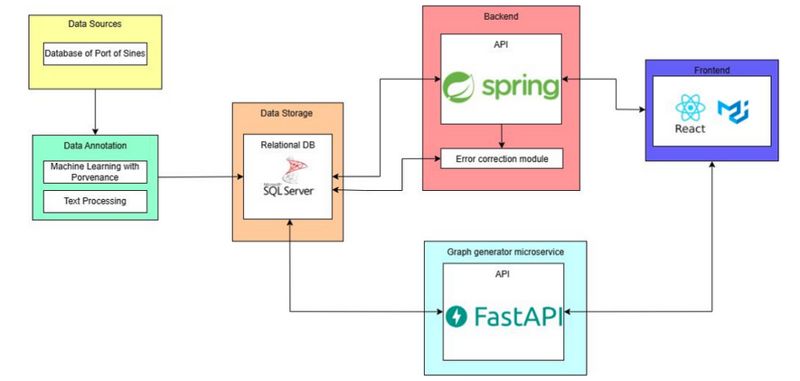

# System Architecture

## 3.1 System Architecture

### 3.1.1 Software Architecture

The architecture of the system is designed to facilitate the **retrieval** 🔍, **processing** ⚙️, **annotation** 🏷️, and **visualization** 📊 of structured data through a **modular** and **service-oriented** approach. It integrates a variety of technologies to ensure **scalability** 📈, **maintainability** 🛠️, and **ease of use**.

At its core, the system collects data from the database, processes and annotates it using specialized services, stores it, and then presents it through interactive visual components.

---

## Presentation Layer

The **Presentation Layer** is implemented as a **Single-Page Application (SPA)** using **React.js (v19)**, along with modern UI and data visualization libraries that provide a **responsive**, **intuitive**, and **interactive** experience.

This layer acts as the main interface for end-users, enabling them to explore, analyze, and download processed data.

### Core Libraries and Frameworks 📚

- **@mui/material, @emotion/react, @emotion/styled**  
  Material UI is used for layout, typography, forms, dialogs, and modals.

- **React Router DOM**  
  Enables client-side routing between dashboards, tables, graphs, and metadata viewers.

- **Axios**  
  Facilitates asynchronous HTTP communication with the Spring Boot backend.

- **date-fns & @mui/x-date-pickers**  
  Used for date manipulation and time-based filters in forms and queries.

- **Bootstrap 5**  
  Complements MUI with responsive layout utilities and additional CSS helpers.

### Data Visualization and Export 📈

- **Plotly.js & react-plotly.js**  
  Renders complex interactive visualizations (e.g., bar charts, scatter plots, time series) with zoom, tooltips, and dynamic axes.

- **Recharts**  
  Lightweight charts for KPIs, summaries, and dashboards.

- **vis-network**  
  Enables graph-based visualization of provenance chains and data relationships.

- **Data Export Functionality**  
  Users can download data in **CSV**, **JSON**, or **Parquet** formats. The frontend requests data from dedicated REST API endpoints, which deliver the requested slice in the selected format.

---

## Backend

The **Backend Layer** is built with **Spring Boot** and acts as the core orchestrator of the platform. It exposes a robust **REST API** that handles:

- Business logic
- Data filtering and retrieval
- Provenance coordination
- Formatting data for frontend visualization or download

### Key Responsibilities ✅

- Data export endpoints (CSV, JSON, Parquet)  
- Routing requests and invoking graph services  
- Database interaction via **JPA repositories**  
- Handling validation, security, and error responses

The backend ensures data integrity and reliability through parameter validation, proper status codes, and modular services that support a scalable and maintainable platform.

---

## Data Storage

The system uses **Microsoft SQL Server** for relational data storage. It stores:

- Graph structures from processed data  
- Metadata and provenance used in analytics

The schema supports **normalization**, **indexing**, and **efficient queries**, ensuring fast responses for frontend requests.

---

## Graph Generator

The **Graph Generator** is a **FastAPI**-based microservice dedicated to processing **data provenance queries**. It performs **no rendering** itself, but:

- Queries the database  
- Builds a graph-like structure of entities, activities, and agents following the **W3C PROV model**  
- Responds with annotated node/edge data for rendering

The frontend uses **vis-network** to display this provenance graph interactively. This separation of concerns keeps the backend lightweight and focused solely on **data structure generation**, improving scalability and performance.

---

## Data Annotation

The **Data Annotation Module** is implemented in **Python using FastAPI** and automates the enrichment of raw data into structured formats. It performs:

- **Syntactic and semantic analysis**  
- **Automatic tagging**, categorization, and provenance enrichment  
- **Light corrections or restructuring** as needed

This service runs automatically during data ingestion, ensuring all data is clean, meaningful, and ready for visualization and export without manual intervention.

---
