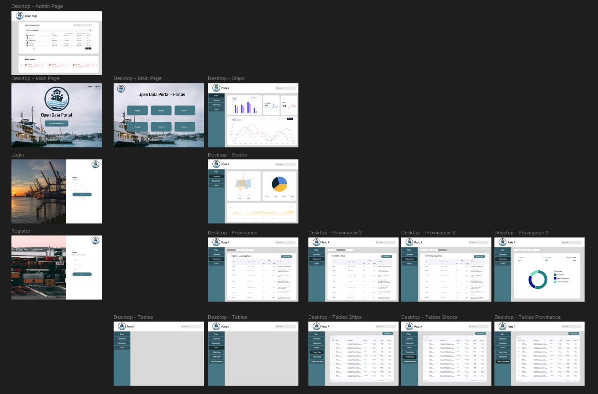

# Website Prototype

## Objective
As part of **Milestone 1** of the _Open Data Portal – Port Management_ project, the team created a **website prototype** to showcase the initial design and interaction flow of the platform.

This prototype represents the first visual iteration of the system and serves as a reference for future development phases, UI refinement, and team feedback.

---

## 🔗 Figma Prototype

👉 [Open the interactive Figma prototype](https://www.figma.com/proto/Sn3yquemOto9IDRQVUX5u1/Frontend-Data-Portal?node-id=0-1&t=ZWQyxV1qK5Fy4QTH-1)

> Navigate between screens and simulate the user experience envisioned in the first milestone.

---

## Highlights
- Data dashboard mockups
- Login / Register flow
- Upload and visualization layout
- Designed for user roles like data scientists, admins, and port workers

---