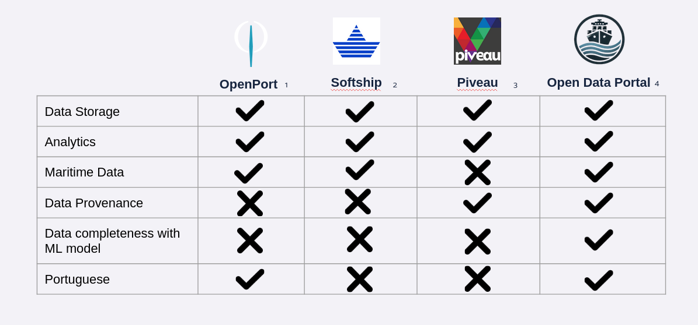

## 🔍 Related Projects

Understanding the state of the art is essential for appropriately positioning the development of an open data portal tailored to the maritime domain. This section provides a critical analysis of relevant platforms, grouped into three main categories: operational maritime logistics solutions, open data management platforms, and Port Community Systems (PCS). The image below offers a graphical summary of this technological landscape.

---

### 🚢 SoftShip

SoftShip is a widely adopted commercial platform for maritime logistics and supply chain management, operating in over 200 ports worldwide. Its integrated modules offer functionalities such as vessel tracking, cargo management, port operation coordination, and end-to-end supply chain visibility.

The platform is highly focused on real-time operations, implementing event-driven architectures capable of processing thousands of operational events per minute. It supports data integration standards such as UN/EDIFACT and ANSI X12, along with proprietary formats.

⚠️ Despite its robust operational capabilities, SoftShip lacks features required for open data publication and analytical exploration. It offers limited support for data provenance tracking and lacks machine learning capabilities for intelligent data enrichment and quality control—key components for data governance and research-driven use cases.

---

### 📊 Piveau

Developed by the Fraunhofer Institute, Piveau is an advanced open data management platform adopted by multiple European governmental agencies and research institutions. It provides sophisticated tools for data cataloging, metadata management, automated data quality assessment, and multi-format data publication.

Piveau adheres to DCAT-AP (Data Catalog Vocabulary Application Profile) standards and supports automated metadata extraction, dataset profiling, and quality scoring. It includes machine learning modules for statistical profiling, pattern recognition, and anomaly detection.

⚠️ However, despite its comprehensive feature set, Piveau lacks domain-specific support for maritime use cases. It does not provide integration with port operation standards, maritime-specific metadata schemas, or validation rules tailored to logistics and port data, which limits its direct applicability in maritime environments.

---

### 🏢 Port Community Systems (PCS)

Port Community Systems are mission-critical infrastructures that enable the digital integration of all stakeholders involved in port operations—including port authorities, customs agencies, logistics operators, and shipping companies. Over 180 PCS are currently operational worldwide. These systems aim to improve operational efficiency, security, and paperless information exchange across the maritime logistics ecosystem.

#### Key Examples

- **🇵🇹 PORTIC (Portugal)**  
  PORTIC is the national PCS platform for Portugal, covering all major ports including Sines, Leixões, and Lisbon. It integrates more than 450 stakeholders and handles over 2.5 million cargo movements annually. It offers real-time vessel tracking, automated customs declarations, and billing integration. While technically advanced, PORTIC’s data sharing model is oriented towards operational coordination, with limited support for open data access or external analytics.

- **🇳🇱 PortBase (Netherlands)**  
  PortBase serves the ports of Rotterdam and Amsterdam, and is considered one of the most sophisticated PCS implementations globally. It manages over 140 million messages per year and supports integration with customs systems, inland transport coordination, and supply chain transparency. PortBase has implemented innovations such as blockchain-based container release, AI-powered cargo optimization, and IoT sensor integration. Despite its capabilities, it operates as a closed commercial system, limiting open data availability and external research use.

- **🇫🇷 SOGET (France)**  
  Operating across several major French ports—including Le Havre, Marseille, and Calais—SOGET supports over 8 million TEU annually. The platform specializes in intermodal transport coordination and has introduced features such as blockchain-based document authentication and multilingual cargo tracking. It has also initiated carbon tracking programs. However, like other PCS platforms, SOGET lacks comprehensive open data portal functionality or analytical tool integration.

---

### ⚠️ Critical Analysis and Limitations

While the reviewed systems offer robust capabilities within their respective domains, none address the specific challenges required by an open maritime data portal initiative. Major limitations include:

- 🚫 **Operational focus over analytical support:** PCS like PORTIC and PortBase are highly optimized for logistics coordination, but provide minimal support for data-driven research, advanced analytics, or scientific exploration.  
- 🔒 **Restricted data access:** Most systems enforce tight access controls, limiting usage to pre-approved stakeholders and excluding broader research or civic innovation.  
- 🛠️ **Lack of advanced data quality controls:** Although basic validation rules exist, most platforms do not support automated data completion, anomaly detection, or robust trustworthiness scoring.  
- 🔄 **Limited interoperability:** The widespread use of proprietary formats and protocols inhibits cross-system data integration and the development of global analytics or benchmark comparisons.

---

### 💡 Final Considerations

This technological overview highlights a significant gap between current solutions and the requirements for a fully open, research-oriented maritime data portal. Bridging this gap represents a critical opportunity—one that lies in combining the strengths of platforms like Piveau (for data openness, quality, and governance) with the operational maturity of PCS implementations. The result would be a next-generation data platform that enhances transparency, innovation, and sustainability in the maritime sector.
