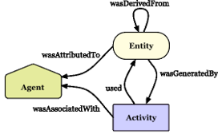

# Provenance and W3C Tables

## Provenance in Information Systems

Provenance refers to the documentation of the **origins**, **context**, and **transformation history** of data. In information systems, provenance plays a crucial role in ensuring **data quality**, **traceability**, and **accountability**. By recording where data comes from, how it was processed, and by whom, provenance allows users to assess the reliability of information and supports **reproducibility** and **compliance** efforts.

Recent years have seen increasing emphasis on provenance in open data, scientific workflows, and critical infrastructure domains such as healthcare, energy, and maritime logistics. Provenance models range from high-level descriptions of data pipelines to fine-grained lineage at the level of individual tuples or values.

In this section, we review two prominent approaches to provenance:

- The **W3C PROV standard** (Section 8.1.1)
- **Tuple-level data provenance** techniques (Section 8.1.2)

🔗 For a detailed presentation on provenance, you can check the [Google Slides here](https://docs.google.com/presentation/d/1l-DR5YPynDRB5mWxZ2Xj1z64TWGtxDwJ/edit?usp=sharing&ouid=100667939769516213354&rtpof=true&sd=true).

---

## 🧩 W3C PROV

The **W3C PROV** standard defines a conceptual model for representing provenance on the Web and in distributed systems. It introduces three main types of elements:

- **Entities** — data or artifacts  
- **Activities** — processes or events  
- **Agents** — actors responsible for processes  

These elements are connected by relations such as:

- `wasGeneratedBy`  
- `used`  
- `wasAssociatedWith`  

Together, they form **directed provenance graphs**.

W3C PROV has been widely adopted in domains where **workflow documentation** and **process transparency** are essential — such as:

- Scientific workflow systems  
- Research data repositories  
- Data catalogs  

Its extensibility and serialization formats (**PROV-XML**, **PROV-JSON**, **PROV-N**) make it ideal for integration into **databases**, **APIs**, and **visualization tools**.

> In **port management and logistics**, applying W3C PROV helps track the lifecycle of maritime datasets from ingestion to publication, enhancing **data governance** and **stakeholder trust**.

---

## 🔍 8.1.2 Tuple-Level Data Provenance

While W3C PROV captures **high-level workflows**, **tuple-level provenance** focuses on tracing **individual output records** back to the specific input records and operations that produced them.

This fine-grained approach is especially useful in:

- Relational databases  
- ETL processes  
- Data integration platforms  

It helps with:

- **Debugging**  
- **Auditing**  
- **Data quality assurance**

### Key Concepts

- **Why-Provenance** — identifies which input tuples are responsible for a given output tuple  
- **Where-Provenance** — shows the source location or origin file of a data value  
- **How-Provenance** — describes the sequence of operations and transformations that produced the result

### Notable Systems

- **Perm**  
- **Trio**  
- **GProM**  

These systems support **automatic provenance tracking** during query execution and generate **explanations** for output tuples.

> In maritime data platforms, tuple-level provenance allows tracing of suspicious or inconsistent data back to original contributors, which is vital in multi-stakeholder environments (e.g., port authorities, logistics operators, shipping agents).

### Combined Provenance

By integrating **tuple-level provenance** with **W3C PROV**:

✅ Full transparency  
✅ Raw-to-published data traceability  
✅ Enhanced error tracking  
✅ Regulatory compliance  
✅ Stronger trust in analytics

---
