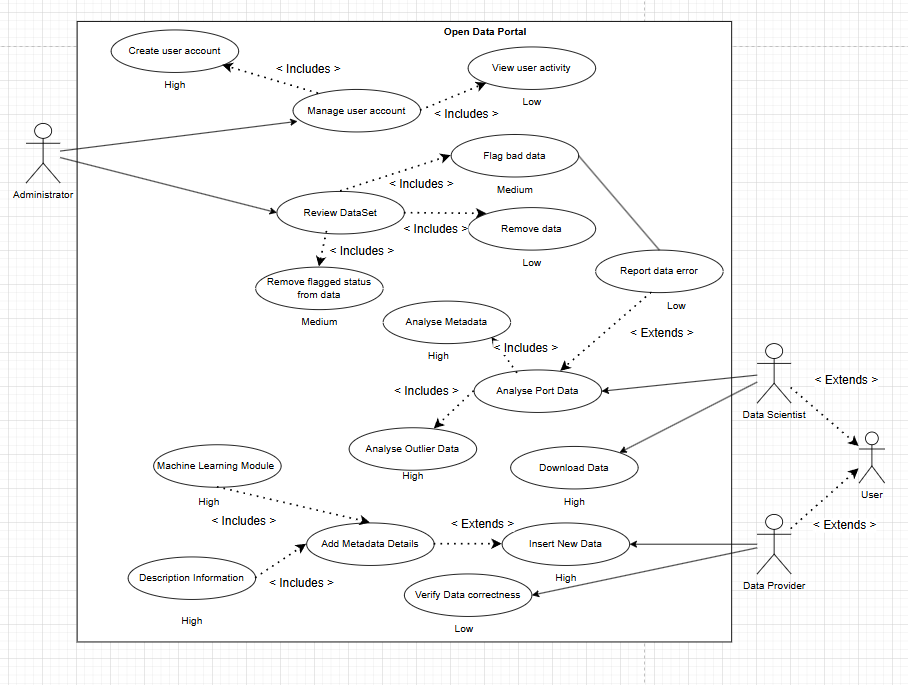

The **Open Data Portal** is designed to support a comprehensive variety of **use cases** that facilitate **data governance**, **quality assurance**, and **analytical exploration**. These use cases reflect the core functional interactions enabled by the system architecture, promoting **transparency** 🔍, **accessibility** 🌐, and **analytical insight** 📊 over publicly available datasets.

### Main Actors 👥

- **Administrator** — Oversees user management, dataset review, and data quality enforcement across the platform.
- **Data Provider** — Responsible for uploading and maintaining data, ensuring accuracy and compliance with platform standards. 
- **Data Scientist** — Engages in analysis, exploration, and insight generation based on available datasets.

---

## Administrator Use Cases

### • Create User Account  
**Actor:** Administrator | **Priority:** High  
Creates user accounts for Data Providers and Data Scientists, defines roles and permissions, and verifies user legitimacy.

### • Manage User Account  
**Actor:** Administrator | **Priority:** High  
Maintains user accounts by updating user info, modifying permissions, deactivating accounts, or resetting credentials.

### • Review Dataset  
**Actor:** Administrator | **Priority:** Medium  
Reviews submitted datasets to ensure compliance with metadata standards, completeness, data quality, and platform policies.

### • Flag Bad Data  
**Actor:** Administrator | **Priority:** Medium  
Identifies and flags datasets or entries with errors, inconsistencies, or quality issues for review or correction.

### • Remove Data  
**Actor:** Administrator | **Priority:** Low  
Removes flagged, outdated, or policy-violating datasets or entries, with proper documentation and notifications.

### • Remove Flagged Status from Data  
**Actor:** Administrator | **Priority:** Medium  
Clears flags from corrected or verified datasets to restore normal access and usability.

### • View User Activity  
**Actor:** Administrator | **Priority:** Low  
Monitors user activities for security, compliance, and insights for platform improvement.

---

## Data Scientist Use Cases

### • Analyse Metadata  
**Actor:** Data Scientist | **Priority:** High  
Examines dataset metadata to assess structure, quality, lineage, and fitness for analytical tasks.

### • Analyse Port Data  
**Actor:** Data Scientist | **Priority:** High  
Performs in-depth analysis of port operational data using interactive tools and visualizations to uncover patterns and insights.

### • Analyse Outlier Data  
**Actor:** Data Scientist | **Priority:** High  
Investigates anomalies and outliers to determine validity, root causes, and impact on analytical results.

### • Download Data  
**Actor:** Data Scientist | **Priority:** High  
Exports datasets in formats like CSV, JSON, or Parquet, with optional filters and transformations.

### • Report Data Error  
**Actor:** Data Scientist | **Priority:** Low  
Reports detected data errors or inconsistencies to administrators for review and correction, contributing to overall data quality.

---

## Data Provider Use Cases

### • Insert New Data  
**Actor:** Data Provider | **Priority:** High  
Uploads new datasets, including mandatory metadata, documentation, and quality checks prior to admin review.

### • Add Metadata Details  
**Actor:** Data Provider | **Priority:** High  
Enriches datasets by providing comprehensive metadata such as data dictionaries, methodologies, update schedules, and provenance.

### • Verify Data Correctness  
**Actor:** Data Provider | **Priority:** Low  
Validates the accuracy of submitted data in response to flagged issues or reported errors.

---

## Cross-Actor Use Cases

### • Machine Learning Module  
**Actors:** System (automated), Data Scientist (monitoring) | **Priority:** High  
Applies ML algorithms to detect missing values, predict completeness, and suggest corrections. All changes are traceable for transparency.

### • Description Information  
**Actors:** All authenticated users | **Priority:** High  
Users can view complete dataset information including descriptions, quality metrics, methodologies, usage guidelines, and provenance graphs.

---

## Actor Summary

### • Administrator 
Oversees platform operations by managing user accounts, reviewing data submissions, and moderating data quality. Duties include flagging/removing invalid data, auditing metadata, and monitoring user activity.

### • Data Scientist 
Interacts with published data for analytical and exploratory tasks. Responsibilities include downloading data, detecting outliers, analyzing metadata, and contributing derived insights for curation and decision-making.

### • Data Provider 
Primarily responsible for uploading and maintaining datasets. Ensures data is accurate, complete, and adheres to schema/provenance rules. May enhance datasets with additional metadata and verify data integrity.
